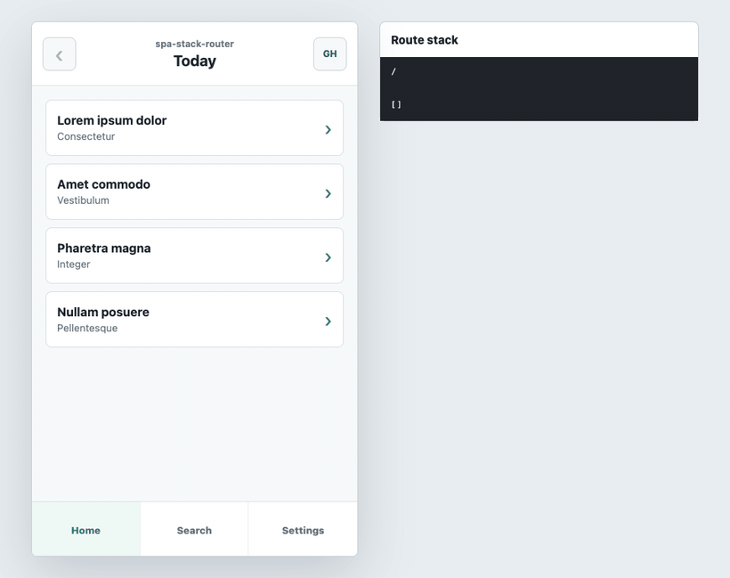

# spa-stack-router

[English](README.md)

[](https://www.npmjs.com/package/spa-stack-router)
[](https://github.com/zidell/spa-stack-router/actions/workflows/pages.yml)
[](https://codecov.io/gh/zidell/spa-stack-router)
[](LICENSE)

프레임워크에 종속되지 않는 작은 SPA 스택 라우터입니다.

웹 앱을 만들다 보면 앱의 라우팅과 브라우저 내비게이션, 즉 뒤로/앞으로 가기와 휴대폰의 엣지 스와이프 동작을 맞춰야 합니다. 둘이 어긋나면 앱다운 경험이 깨집니다. `spa-stack-router`는 해시 또는 History API를 사용해 화면 스택을 URL에 저장함으로써 브라우저 내비게이션과 앱의 라우팅이 함께 움직이게 합니다.

[라이브 데모](https://zidell.github.io/spa-stack-router/)



`spa-stack-router`는 네이티브 앱처럼 화면 이동을 모델링합니다. 하위 화면을 push하고, 이전 화면으로 pop하며, 현재 화면을 교체하거나 다른 루트 스택으로 전환할 수 있습니다. 스택은 URL에 저장되므로 새로고침, 링크 공유, 브라우저 뒤로 가기도 자연스럽게 동작합니다.

목록 → 상세 → 모달처럼 앱 같은 화면 계층이 있고, 프레임워크 전용 라우터 없이 그 계층을 URL에 반영하고 싶을 때 사용하세요.

이 라이브러리는 UI를 렌더링하지 않으며 React, Vue 등 어떤 프레임워크에도 의존하지 않습니다. npm에서 가져와 스택 변경을 구독하고, 앱의 상태 모델에 연결하면 됩니다.

## 설치

```sh
npm install spa-stack-router
```

## 빠른 시작

```js
import router from 'spa-stack-router';

router.init();

const unsubscribe = router.subscribe((stack) => {
	const top = stack.at(-1);
	render(top ?? { screen: 'home', value: '' });
});

router.push('detail.42');
router.push('modal.info');
router.pop();
unsubscribe();
```

기본 모드는 `history`이며, 빈 루트는 다음과 같습니다.

```text
https://example.com/
```

`router.push('detail.42')`를 호출하면 URL은 다음처럼 바뀝니다.

```text
https://example.com/detail.42
```

## 라우트 세그먼트

스택의 각 항목은 URL 경로 세그먼트 하나입니다.

```text
screen.value
```

기본적으로 첫 번째 `.`만 구분자로 처리합니다. 그 뒤의 값은 앱이 해석할 수 있는 하나의 불투명한 값으로 그대로 유지됩니다.

```js
// URL: /folder.documents/viewer.abc.123
[
	{
		screen: 'folder',
		segment: 'folder.documents',
		value: 'documents'
	},
	{
		screen: 'viewer',
		segment: 'viewer.abc.123',
		value: 'abc.123'
	}
]
```

구분자가 없으면 `value`는 빈 문자열입니다.

```js
// Segment: settings
{
	screen: 'settings',
	segment: 'settings',
	value: ''
}
```

다른 구분자가 더 잘 맞는다면 `delimiter`를 사용하세요.

```js
router.init({ delimiter: ':' });
router.push('viewer:abc.123');
```

## 인스턴스 만들기

기본 export는 바로 사용할 수 있는 라우터 인스턴스입니다. 독립된 인스턴스가 필요하면 `createStackRouter()`를 사용하세요.

```js
import { createStackRouter } from 'spa-stack-router';

const router = createStackRouter({
	basePath: '/app'
});

router.init();
```

## API

### `createStackRouter(options?)`

독립된 라우터 인스턴스를 만듭니다.

```js
const router = createStackRouter({
	mode: 'history',
	delimiter: '.',
	escToBack: true,
	basePath: '',
	callback: (stack) => {},
	exposeGlobal: false
});
```

옵션:

- `mode`: `'history'` 또는 `'hashbang'`. 기본값: `'history'`.
- `delimiter`: `screen`과 `value`를 구분하는 문자. 기본값: `'.'`.
- `escToBack`: Escape 키를 누르면 `pop()`을 호출합니다. 기본값: `true`.
- `basePath`: history 모드의 경로 접두사입니다. 예: `/app`. 기본값: `''`.
- `callback`: 스택이 바뀔 때마다 호출됩니다.
- `exposeGlobal`: `true`이면 라우터를 `window.routes`로 노출합니다. 문자열이면 해당 이름의 window 속성으로 노출합니다.

### `router.init(options?)`

현재 URL을 스택으로 읽고 브라우저 내비게이션 수신을 시작합니다.

```js
router.init({ basePath: '/app' });
```

여기에도 `createStackRouter()`와 같은 옵션을 전달할 수 있습니다. 기본 export를 사용할 때 유용합니다.

```js
import router from 'spa-stack-router';

router.init({
	mode: 'hashbang',
	delimiter: ':'
});
```

### `router.subscribe(callback)`

스택 변경을 구독합니다. 콜백은 현재 스택으로 즉시 한 번 호출됩니다.

```js
const unsubscribe = router.subscribe((stack) => {
	setStack(stack);
});
```

### `router.push(segment)`

현재 스택에 하위 화면을 push합니다.

```js
router.push('detail.42');
```

### `router.pop()`

브라우저 히스토리를 이용해 한 단계 뒤로 이동합니다.

```js
router.pop();
```

### `router.replace(segment)`

새 브라우저 히스토리 항목을 만들지 않고 현재 최상단 화면을 교체합니다.

```js
router.replace('detail.43');
```

### `router.navigate(segment, options?)`

스택을 고려한 방식으로 세그먼트로 이동합니다.

```js
router.navigate('detail.99');
router.navigate('/search');
router.navigate('/inbox/thread.42/message.7');
router.navigate('/inbox/thread.42/message.7', { rebuild: true });
```

동작 방식:

- `'detail.99'` 같은 상대 세그먼트: 현재 스택에 push합니다.
- `'/search'` 같은 절대 세그먼트: 전체 스택을 교체합니다.
- 스택에 이미 있는 화면 이름: 해당 화면 단계를 중복하지 않고 교체합니다.
- `options.rebuild: true`: 절대 대상의 세그먼트를 하나씩 쌓아 다시 구성합니다.

### `router.popTo(targetDepth, callback?)`

브라우저 히스토리를 이용해 지정한 스택 깊이까지 pop합니다.

```js
router.popTo(0);
```

깊이는 활성 스택 항목의 수입니다. 빈 루트 URL의 깊이는 `0`, `/detail.42`는 `1`, `/list/detail.42`는 `2`입니다.

### `router.getStack()`

현재 파싱된 라우트 스택을 반환합니다.

```js
const stack = router.getStack();
```

### `router.getDepth()`

현재 스택 깊이를 반환합니다.

```js
const depth = router.getDepth();
```

### `router.destroy()`

`init()`이 등록한 이벤트 리스너를 제거합니다.

```js
router.destroy();
```

## History 모드

History 모드가 기본값입니다.

```js
const router = createStackRouter({
	mode: 'history',
	basePath: '/app'
});
```

URL은 다음과 같은 형태입니다.

```text
https://example.com/app/inbox/message.42
```

서버는 `basePath` 아래의 모든 경로에 SPA 엔트리 문서를 제공해야 합니다.

## Hashbang 모드

Hashbang 모드는 `#!/` 뒤에 스택을 저장합니다.

```js
const router = createStackRouter({
	mode: 'hashbang'
});
```

URL은 다음과 같은 형태입니다.

```text
https://example.com/#!/inbox/message.42
```

Hashbang 모드는 서버에서 history fallback 경로를 설정할 수 없을 때 유용합니다.

## 프레임워크 사용법

### React

```jsx
import { useEffect, useMemo, useState } from 'react';
import { createStackRouter } from 'spa-stack-router';

export function App() {
	const router = useMemo(() => createStackRouter(), []);
	const [stack, setStack] = useState([]);

	useEffect(() => {
		router.init();
		const unsubscribe = router.subscribe(setStack);
		return () => {
			unsubscribe();
			router.destroy();
		};
	}, [router]);

	const top = stack.at(-1);

	return (
		<main>
			<button onClick={() => router.push('detail.42')}>Open</button>
			<button onClick={() => router.pop()}>Back</button>

			{stack.length === 0 ? (
				<section>home</section>
			) : (
				stack.map((route, index) => (
					<section key={`${route.segment}-${index}`} hidden={route !== top}>
						{route.screen}: {route.value}
					</section>
				))
			)}
		</main>
	);
}
```

### Vue

```vue
<script setup>
import { onMounted, onUnmounted, ref } from 'vue';
import { createStackRouter } from 'spa-stack-router';

const router = createStackRouter();
const stack = ref([]);
let unsubscribe;

onMounted(() => {
	router.init();
	unsubscribe = router.subscribe((nextStack) => {
		stack.value = nextStack;
	});
});

onUnmounted(() => {
	unsubscribe?.();
	router.destroy();
});
</script>

<template>
	<main>
		<button @click="router.push('detail.42')">Open</button>
		<button @click="router.pop()">Back</button>

		<section v-if="stack.length === 0">home</section>
		<template v-else>
			<section
				v-for="(route, index) in stack"
				:key="`${route.segment}-${index}`"
				:hidden="route !== stack.at(-1)"
			>
				{{ route.screen }}: {{ route.value }}
			</section>
		</template>
	</main>
</template>
```

### Svelte

`router.subscribe`는 Svelte store와 같은 형태를 따릅니다.

```svelte
<script>
	import { createStackRouter } from 'spa-stack-router';

	const router = createStackRouter();
	router.init();
</script>

<button on:click={() => router.push('detail.42')}>Open</button>
<button on:click={() => router.pop()}>Back</button>

{#each $router as route}
	<section hidden={route !== $router[$router.length - 1]}>
		{route.screen}: {route.value}
	</section>
{:else}
	<section>home</section>
{/each}
```

### Vanilla JavaScript

```js
import { createStackRouter } from 'spa-stack-router';

const router = createStackRouter();
const app = document.querySelector('#app');

router.subscribe((stack) => {
	const top = stack.at(-1);
	app.innerHTML = stack.length
		? stack
				.map(
					(route, index) => `
						<section ${route !== top ? 'hidden' : ''}>
							${route.screen}: ${route.value}
						</section>
					`
				)
				.join('')
		: '<section>home</section>';
});

router.init();
```

## 데모

이 저장소에는 실행 가능한 SPA 스타일 데모와 프레임워크별 예제가 포함되어 있습니다.

```sh
npm run demo:dev
```

데모에서는 타이틀 바, 목록 화면, push된 상세 화면, push된 모달 화면, 탭 방식의 스택 교체, 빈 루트 URL, 브라우저 뒤로 가기 동작을 확인할 수 있습니다.

## 개발

```sh
npm install
npm run check
npm test
npm run build
```

배포 전:

```sh
npm pack --dry-run
npm publish --access public
```

## 라이선스

MIT
